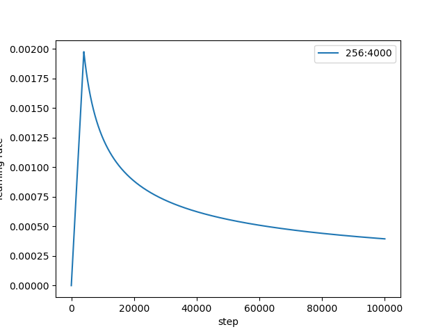
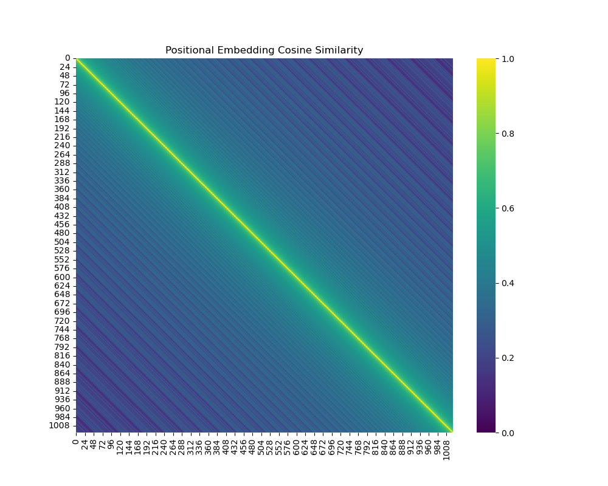
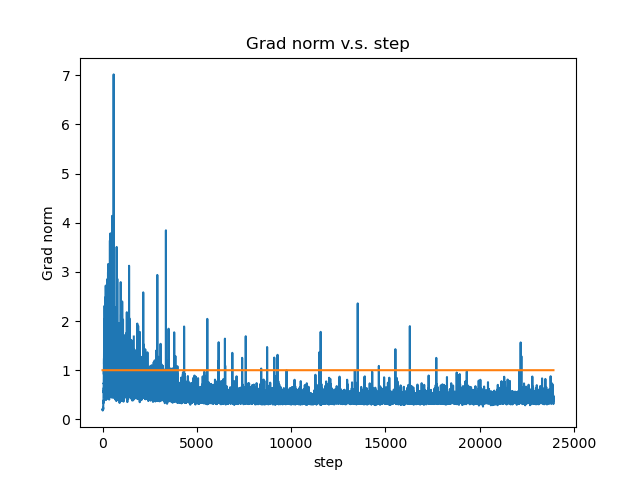

## 任务描述

- seq2seq 序列到序列预测: 将英文翻译为繁体中文

## 数据集

- 数据来源: TED2020
  - https://github.com/yuhsinchan/ML2022-HW5Dataset/releases/download/v1.0.2/ted2020.tgz
    - 包含: raw.en, raw.zh 398,066 (sentences) 
  - https://github.com/yuhsinchan/ML2022-HW5Dataset/releases/download/v1.0.2/test.tgz
    - 包含: test.en, test.zh 4,000 (sentences)

## 数据预处理

1. 将全角字符转换为半角字符
2. 清理字符串
   - 对于英文(en), 它会删除括号内的文本、去除连字符、保留并标准化标点符号
   - 对于中文(zh), 它会将全角字符转换成半角字符、删除括号内的文本、去除连字符、保留并标准化标点符号
3. 根据设定的长度和长度比例标准筛选句子
4. 训练 SentencePiece 模型并使用其进行分词, 将句子转换成一系列子词 subword tokenization, 以解决 Out of Vocabulary 问题
5. 使用 fairseq 将文本数据转换为二进制数据

以下为样例代码: 

```python
def strQ2B(ustring):
    # 负责将全角字符（比如中文字符或全角标点）转换成半角字符
    # reference:https://ithelp.ithome.com.tw/articles/10233122
    ss = []
    for s in ustring:
        rstring = ""
        for uchar in s:
            inside_code = ord(uchar)
            if inside_code == 12288: 
                # 全角空格（Unicode码为12288）半角空格（ASCII码为32）
                inside_code = 32
            elif (inside_code >= 65281 and inside_code <= 65374):
                # 检查字符是否为其他全角字符
                inside_code -= 65248
            rstring += chr(inside_code)
        ss.append(rstring)
    return ''.join(ss)
```

```python
def clean_s(s, lang):
    # 用于清理单个字符串
    # 对于英文（en），它会删除括号内的文本、去除连字符、保留并标准化标点符号
    # 对于中文（zh），它会将全角字符转换成半角字符、删除括号内的文本、去除连字符、保留并标准化标点符号
    if lang == 'en':
        s = re.sub(r"\([^()]*\)", "", s)  # 使用正则表达式去除括号及其内部的内容
        s = s.replace('-', '')  # 去除连字符
        s = re.sub('([.,;!?()\"])', r' \1 ', s)  # 标准化标点符号, 使其周围有空格
    elif lang == 'zh':
        s = strQ2B(s)  # 将全角字符转换为半角字符
        s = re.sub(r"\([^()]*\)", "", s)
        s = s.replace(' ', '')
        s = s.replace('—', '')
        s = s.replace('“', '"')
        s = s.replace('”', '"')
        s = s.replace('_', '')
        s = re.sub('([。,;!?()\"~「」])', r' \1 ', s)
    s = ' '.join(s.strip().split())  # 去除字符串首尾的空白字符，并确保单词间只有一个空格
    return s
```

```py
def clean_corpus(prefix, l1, l2, ratio=9, max_len=1000, min_len=1):
    # 用于清理语料库
    # 先检查清理后的文件是否已存在
    # 如果不存在，它逐行读取两种语言的语料文件，使用clean_s函数进行清理
    # 并根据设定的长度和长度比例标准（ratio, max_len, min_len）筛选句子
    # 最后，将清理和筛选后的语句写入新的文件中。
    if Path(f'{prefix}.clean.{l1}').exists() and Path(f'{prefix}.clean.{l2}', encoding='utf-8').exists():
        print(f'{prefix}.clean.{l1} & {l2} exists. skipping clean.')
        return
    with open(f'{prefix}.{l1}', 'r', encoding='utf-8') as l1_in_f:
        with open(f'{prefix}.{l2}', 'r', encoding='utf-8') as l2_in_f:
            with open(f'{prefix}.clean.{l1}', 'w', encoding='utf-8') as l1_out_f:
                with open(f'{prefix}.clean.{l2}', 'w', encoding='utf-8') as l2_out_f:
                    for s1 in l1_in_f:
                        s1 = s1.strip()
                        s2 = l2_in_f.readline().strip()
                        s1 = clean_s(s1, l1)
                        s2 = clean_s(s2, l2)
                        s1_len = len_s(s1, l1)
                        s2_len = len_s(s2, l2)
                        if min_len > 0:  # remove short sentence
                            if s1_len < min_len or s2_len < min_len:
                                continue
                        if max_len > 0:  # remove long sentence
                            if s1_len > max_len or s2_len > max_len:
                                continue
                        if ratio > 0:  # remove by ratio of length
                            if s1_len / s2_len > ratio or s2_len / s1_len > ratio:
                                continue
                        print(s1, file=l1_out_f)
                        print(s2, file=l2_out_f)
```

```py
valid_ratio = 0.01
train_ratio = 1 - valid_ratio

if (prefix / f'train.clean.{src_lang}').exists() \
        and (prefix / f'train.clean.{tgt_lang}').exists() \
        and (prefix / f'valid.clean.{src_lang}').exists() \
        and (prefix / f'valid.clean.{tgt_lang}').exists():
    print(f'train/valid splits exists. skipping split.')
else:
    # 生成标签作为数据集中句子的索引, 并随机打乱这些标签
    line_num = sum(1 for line in open(f'{data_prefix}.clean.{src_lang}', encoding='utf-8'))
    labels = list(range(line_num))
    random.shuffle(labels)
    for lang in [src_lang, tgt_lang]:
        train_f = open(os.path.join(data_dir, dataset_name, f'train.clean.{lang}'), 'w', encoding='utf-8')
        valid_f = open(os.path.join(data_dir, dataset_name, f'valid.clean.{lang}'), 'w', encoding='utf-8')
        count = 0
        for line in open(f'{data_prefix}.clean.{lang}', 'r', encoding='utf-8'):
            # 根据判预设的训练集比例断当前行是否应该归入训练集
            if labels[count] / line_num < train_ratio:
                train_f.write(line)
            else:
                valid_f.write(line)
            count += 1
        train_f.close()
        valid_f.close()
```

```py
# 训练 SentencePiece 模型并使用其进行分词, 将句子转换成一系列子词 subword tokenization
import sentencepiece as spm

vocab_size = 8000
if (prefix / f'spm{vocab_size}.model').exists():
    print(f'{prefix}/spm{vocab_size}.model exists. skipping spm_train.')
else:
    spm.SentencePieceTrainer.train(
        input=','.join([f'{prefix}/train.clean.{src_lang}',
                        f'{prefix}/valid.clean.{src_lang}',
                        f'{prefix}/train.clean.{tgt_lang}',
                        f'{prefix}/valid.clean.{tgt_lang}']),
        model_prefix=prefix / f'spm{vocab_size}',
        vocab_size=vocab_size,
        character_coverage=1,  # 设定字符覆盖率为 100%
        model_type='unigram',  # 选择模型类型为 'unigram', 也可以选择 'bpe'
        input_sentence_size=1e6,  # 指定用于训练的句子数量, 设定每次读入的句子数量为 100w
        shuffle_input_sentence=True,  # 在训练前对句子进行随机排序
        normalization_rule_name='nmt_nfkc_cf',  # 使用 'nmt_nfkc_cf' 来规范化文本
    )

spm_model = spm.SentencePieceProcessor(model_file=str(prefix / f'spm{vocab_size}.model'))
in_tag = {
    'train': 'train.clean',
    'valid': 'valid.clean',
    'test': 'test.raw.clean',
}
for split in ['train', 'valid', 'test']:
    for lang in [src_lang, tgt_lang]:
        out_path = prefix / f'{split}.{lang}'
        if out_path.exists():
            print(f"{out_path} exists. skipping spm_encode.")
        else:
            with open(prefix / f'{split}.{lang}', 'w', encoding='utf-8') as out_f:
                with open(prefix / f'{in_tag[split]}.{lang}', 'r', encoding='utf-8') as in_f:
                    for line in in_f:
                        line = line.strip()
                        tok = spm_model.encode(line, out_type=str)
                        print(' '.join(tok), file=out_f)
```

```shell
# 将文本数据转换为二进制数据
# 注意将其中的 src_lang tgt_lang prefix binpath 替换
python -m fairseq_cli.preprocess --source-lang {src_lang} --target-lang {tgt_lang} --trainpref {prefix/'train'} --validpref {prefix/'valid'} --testpref {prefix/'test'} --destdir {binpath} --joined-dictionary --workers 2
```


## 模型定义

- 样例代码中使用了双向 RNN, 在 RNN Decoder 中实现了 Attention 注意力层.
- Strong Baseline 任务中要求使用 Transformer.

具体细节在此不在展开讨论.

## Label-Smoothed Cross-Entropy Criterion

本次任务中的损失函数将**标签平滑**(Label Smoothing)与**交叉熵**(Cross Entropy)相结合. 具体代码实现如下:

```py
class LabelSmoothedCrossEntropyCriterion(nn.Module):
    def __init__(self, smoothing, ignore_index=None, reduce=True):
        # smoothing: 标签平滑的参数, 控制标签平滑的强度
        # reduce: 是否对损失进行求和
        super().__init__()
        self.smoothing = smoothing
        self.ignore_index = ignore_index
        self.reduce = reduce

    def forward(self, lprobs, target):
        # lprobs: 模型输出的对数概率 [batch_size, vocab_size]
        # target: 真实标签
        # 确保在计算交叉熵损失时，目标标签的维度与模型输出的对数概率的维度匹配
        if target.dim() == lprobs.dim() - 1:
            target = target.unsqueeze(-1)
        # 计算负对数似然损失 (NLL)
        nll_loss = -lprobs.gather(dim=-1, index=target)
        # 对模型输出的所有类别的对数概率进行求和
        # 结合标签平滑, 即不仅考虑正确类别的损失, 即nll_loss, 还要考虑其他类别的损失
        smooth_loss = -lprobs.sum(dim=-1, keepdim=True)
        if self.ignore_index is not None:
            pad_mask = target.eq(self.ignore_index)
            nll_loss.masked_fill_(pad_mask, 0.0)
            smooth_loss.masked_fill_(pad_mask, 0.0)
        else:
            nll_loss = nll_loss.squeeze(-1)
            smooth_loss = smooth_loss.squeeze(-1)
        if self.reduce:
            nll_loss = nll_loss.sum()
            smooth_loss = smooth_loss.sum()
        # 计算每个类别平滑的概率, 将 smoothing 值均匀分配给除了正确标签之外的所有类别
        eps_i = self.smoothing / lprobs.size(-1)
        # 结合正常的交叉熵损失和标签平滑的损失
        loss = (1.0 - self.smoothing) * nll_loss + eps_i * smooth_loss
        return loss
```


## Leaning rate scheduling

本次作业中使用了动态调整学习率的策略. 这种学习率调度方法通常称为 Noam 学习率调度, 来自于提出 Transformer 的原始论文  [Attention is all you need ](https://arxiv.org/abs/1706.03762). 
$$
lrate = d_{model}^{-0.5}\cdot \min(step\_num^{-0.5},step\_num\cdot warmup\_steps^{-1.5})
$$


该调度分为两个阶段:

- 线性预热阶段
  - 训练初期, 学习率从零开始线性增加, 在训练初期避免大的梯度更新, 同时学习率的增加也避免了由于学习率过低而导致的慢启动.
- 衰减阶段
  - 预热阶段结束后, 学习率开始以与训练步数的平方根成反比的速度减小, 有助于模型稳定地收敛.

这种方式考虑了模型的大小, 使得更大的模型使用更小的学习率，从而在不同规模的模型间提供了一种平衡.

## 得分

由于本次课程作业只有台大的学生可以提交结果, 所以未能得到最终分数. 以下只对模型进行修改, 并给出 BLEU 分数.

### Simple Baseline: 14.58

运行样例代码, BLEU 得分为

```
BLEU = 16.32
```

### Medium Baseline: 18.04

- 添加学习率调度器

$$
lrate = d_{model}^{-0.5}\cdot \min(step\_num^{-0.5},step\_num\cdot warmup\_steps^{-1.5})
$$

```py
def get_rate(d_model, step_num, warmup_step):
    lr = d_model ** (-0.5) * min(step_num ** (-0.5), step_num * warmup_step ** (-1.5))
    return lr
```

- 训练更长时间 `max_epoch = 30`

```
BLEU = 18.21
```

### Strong Baseline: 25.20

- 使用 Transformer

  ```py
  from fairseq.models.transformer import (
      TransformerEncoder,
      TransformerDecoder,
  )
  ```

  ```py
  encoder = TransformerEncoder(args, src_dict, encoder_embed_tokens)
  decoder = TransformerDecoder(args, tgt_dict, decoder_embed_tokens)
  ```

- 设置 Transformer 的参数

  ```py
  arch_args = Namespace(
      encoder_embed_dim=256,
      encoder_ffn_embed_dim=512,
      encoder_layers=4,
      decoder_embed_dim=256,
      decoder_ffn_embed_dim=1024,
      decoder_layers=4,
      share_decoder_input_output_embed=True,
      dropout=0.3,
  )
  
  # 适配 Transformer 的参数
  def add_transformer_args(args):
      args.encoder_attention_heads = 4
      args.encoder_normalize_before = True
  
      args.decoder_attention_heads = 4
      args.decoder_normalize_before = True
  
      args.activation_fn = "relu"
      args.max_source_positions = 1024
      args.max_target_positions = 1024
  
      # 设置 Transformer 中以上未提到的其他参数
      from fairseq.models.transformer import base_architecture
      base_architecture(arch_args)
  
  add_transformer_args(arch_args)
  ```

- 以上模型的参数来源于 [Attention is all you need ](https://arxiv.org/abs/1706.03762) 原论文中的 base 参数, 并稍作修改.
- Train longer: `max_epoch = 45`

```
BLEU = 23.28 // args.encoder_attention_heads = args.decoder_attention_heads = 4
BLEU = 23.51 // args.encoder_attention_heads = args.decoder_attention_heads = 8
```

### Boss Baseline: 29.13

Back-Translation 由于自身水平和时间有限未能完成, 略有遗憾. 或许未来能补上这一课.


## Problem 1: Visualize Positional Embedding

在 Boss Baseline 的任务中, 我们使用了 Transformer. Transformer 的 decoder 中使用了 Positional Embedding, 用于表示序列中每个位置的相对或绝对位置. 该 problem 要求我们给出 Positional Embedding 的相似度矩阵, 并对其可视化.

使用

```py
pos_emb = model.decoder.embed_positions.weights.cpu().detach()
```

即可得到 decoder 中 Positional Embedding 的值. 其中 `pos_emb` 是一个大小为 `[序列长度, 嵌入编码维度]` 的矩阵. 在 Boss Baseline 的任务中,  `pos_emb` 大小为 `torch.Size([1026, 256])`.

对于 Positional Embedding 中每一对嵌入向量, 我们使用 `torch.nn.functional.cosine_similarity()` 计算它们之间的余弦相似度. [Pytorch 文档]((https://pytorch.org/docs/stable/tensors.html#torch.Tensor))中对其描述如下:

> torch.nn.functional.cosine_similarity(*x1*, *x2*, *dim=1*, *eps=1e-8*) → [Tensor]
>
> - x1 (*Tensor)* – First input.
> - x2 (*Tensor*) – Second input.
> - dim (*int*, *optional*) – Dimension along which cosine similarity is computed. Default: 1
> - eps (*float, optional*) – Small value to avoid division by zero. Default: 1e-8

余弦相似度 Cosine Similarity:
$$
similarity = \frac{x_1\cdot x_2}{\max(\vert\vert x_1\vert\vert_2,\epsilon)\cdot\max(\vert\vert x_2\vert\vert_2,\epsilon)}
$$

```python
ret = torch.nn.functional.cosine_similarity(pos_emb[:, None, :], pos_emb[None, :, :], dim=-1)
```

得到 `ret` 是一个大小为 `torch.Size([1026, 1026])` 的矩阵, 其中第 (i, j) 个元素的大小反映了原 Positional Embedding 中一条序列第 i 个位置的向量与第 j 个向量的嵌入编码的相似度.

```py
import seaborn as sns

sns.heatmap(ret, cmap='viridis')
```

得到图片如下



可以看出, 相邻位置的相邻向量的嵌入编码的相似度较高, 且随着两个向量在原序列中的位置距离变远, 其嵌入编码的相似度变低.

## Problem 2: Clipping Gradient Norm

在 Medium Baseline 任务中, 我们使用的是双向 RNN, 容易出现 Gradient Explosion 的问题, 于是需要使用 Clipping Gradient Norm 梯度裁切的方法来避免.

该 problem 要求我们可视化实现 Clipping Gradient Norm 的效果, 并标记出发生 Gradient Explosion 的位置, 也就是 Clipping Gradient Norm 发挥作用的地方.

在函数 `train_one_epoch()` 中, `gnorm = nn.utils.clip_grad_norm_(model.parameters(), config.clip_norm)` 计算了未经裁切的所有参数梯度的总范数, 默认是 $L_2$ 范数. 只需记录每一步的梯度, 然后绘制图表即可.

```py
gnorms = []
def train_one_epoch(...):
	...
	gnorm = nn.utils.clip_grad_norm_(model.parameters(), config.clip_norm)
	...
	# 记录 Gradient_norm
    gnorms.append(gnorm.cpu().item())
 	...

plt.plot(range(1, len(gnorms)+1), gnorms)
plt.plot(range(1, len(gnorms)+1), [config.clip_norm]*len(gnorms), "-")
plt.title('Grad norm v.s. step')
plt.xlabel("step")
plt.ylabel("Grad norm")
```



## BLEU 分数

这次作业中使用了  BLEU 分数来评估翻译质量的好坏. **BLEU 分数**(Bilingual Evaluation Understudy Score)是一种评估机器翻译质量的方法, 广泛用于自然语言处理领域. 它通过比较机器翻译的结果与人工翻译的参考文本来计算分数.

BLEU 算法首先对对机器翻译得到的句子与人工翻译的得到的句子进行 n-gram 比较. n-gram 即一个包含 n 个项的序列. 通常会计算从 1-gram到 4-gram 的匹配度, 例如

```
对于句子 "The guard arrived late because it was raining"
1-gram: "The", "guard", "arrived", "late", "because", "it", "was", "raining", 即每个单词之间都进行比较是否匹配
4-gram: "The guard arrived late", "guard arrived late because",..., 即短语之间的比较
```

n-gram 中的项在句子中是连续的.

BLEU 分数的范围是 0 到 1, 其中 1 表示完美匹配, 0 表示没有匹配. BLEU 分数通常乘以 100，转换为百分比形式.

## Label Smoothing

本次作业中使用了 Label Smoothing 的技术. 在分类任务中, 假设有 n 个类别, 一个样本的标签通常是一个 n 维的 one-hot 向量, 如 `[0, 0,..., 1, 0,...0]`, 其中正确类别的位置为 1, 其余位置为 0. 这类标签称为**硬标签**(hard labels). 如果使用硬标签, 当模型训练时会倾向于使某个位置上的概率值尽可能接近 1 或 0, 这便增加了过拟合的风险.


Label Smoothing 的思想是, 将硬标签转换成**软标签**(soft labels), 即将 `[0, 0,..., 1, 0,...0]` 转换成类似于 `[0.1, 0.1,..., 0.9, 0.1,..., 0.1]` 这样的标签. 通过将对一个位置的确定程度分散到其它位置, 可以增强模型的泛化能力, 减少过拟合的风险, 并增强模型的鲁棒性.

但在某些任务中, Label Smoothing 也有可能降低模型的预测能力, 因此需要根据具体任务和数据集的特点来判断技术的使用.


